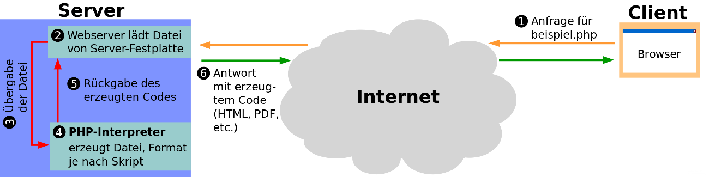

# Hintergund

- Seit 1995
- "Hypertext Preprocessor"
- Für dynamische Websites, vorallem Datenbanken
- (Mit Datenbanken wird mit u.a. "MySQL" kommuniziert)
- Kann man auch für normale Programme verwenden (GUIs und CLIs)
- GUI = Graphical User Interface = Fenster wie der Internetbrowser z.B.
- CLI = Commandline-Interface = Terminal/CMD /Kommandozeile
- PHP-Dateien liegen auf Server -> Server führt PHP-Interpreter aus -> Wir bekommen Lösung

- Interpreter ist ein Programm auf dem Server
- Interpreter geschrieben in "C" (andere Programmiersprache)
=> Mit PHP sprechen wir mit dem Interpreter, der für uns rechnet und tut was wir sagen
